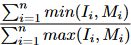

L’objectif de ce projet est d’implémenter une méthode de comparaison d’images
en se basant sur l’histogramme couleur de celles-ci, afin d’en étudier l’efficacité
sur différents ensembles d’images dans différents espaces de couleurs (gris, rgb et rg,by,wb). Le papier ”Swain et Ballard, Color indexing, International Jour-
nal of ComputerVision,7 :1, 11-32 (1991)” contient l'espace de couleur utilisé dans ce projet
ainsi que la formule d’intersection d’histogrammes utilisée pour la comparaison d'images.

L'espace rg,by,wb est défini par:
- rg = r − g
- by = 2 ∗ b − r − g
- wb = r + g + b

Formule d'intersection d'histogrammes:

Où I et M sont deux vecteurs caractéristiques de deux images.
On intègre cette formule d’intersection dans un mécanisme
de requêtes, en triant les images par ordre de similarité, pour récupérer les k
plus proches.

J'ai aussi testé un clustering par kmeans et commencé une représentation par graphe des images pour la comparaison

- ```segmentation.py``` permet d'obtenir les masques des objets pour ignorer le fond
- ```plotxlsx.py``` evaluation et affichage des résultats
- ```kmeans.py``` clustering des vecteurs avec méthode elbow
- ```ter.py``` script principal qui permet d'effectuer la comparaison des images dans les 3 espaces de couleurs
- ```region_graph.py``` permet de créer un graph dont les noeuds représentent les régions obtenues par segmentation avec kmeans, et les arrêtes les relations d'adjacence


# Bibliotèques
- ```pip install opencv-python```
- ```pip install kneed```
- ```pip install networkx```
- ```pip install scipy```
- ```pip install natsort```
